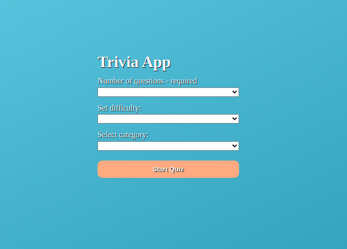
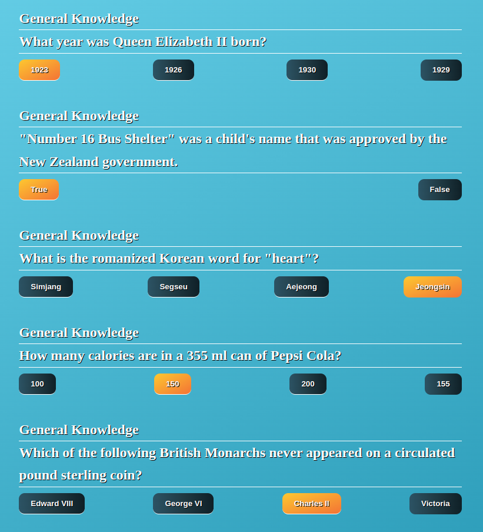
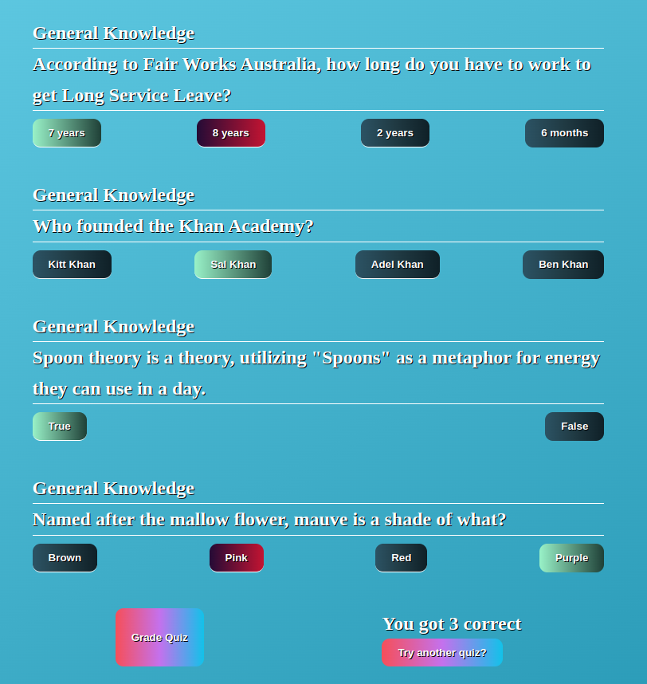

Simple Quiz App that connects to the Trivia API db.

You select the number of questions, category, & difficulty.

The <Quiz /> component will then be rendered with the category, questions, 
and answers rendered (selected answers are in orange).

After you press the 'Grade Quiz' button the correct answers will be rendered
in green & wrong answers in red. You'll also see the number of correct
answers at the bottom with the option to try another quiz. This will take
you back to the <HomePage /> component where you can change quiz options.

